# Настройка ноды Meshtastic

## Введение

**Meshtastic** — это открытый проект, который превращает недорогие LoRa-радио в платформу для дальней автономной связи в местах, где нет интернета или сотовой сети. Устройства образуют **mesh-сеть** (ячеистую сеть), в которой каждый узел автоматически ретранслирует сообщения дальше, что позволяет передавать данные на десятки километров без вышек и роутеров.

### Как это работает

Сеть строится на технологии **LoRa** — это беспроводной протокол дальнего радиуса действия с низким энергопотреблением, который не требует лицензий или разрешений в большинстве регионов. Устройства (ноды) соединяются с телефоном или компьютером через Bluetooth, Wi-Fi или USB и обмениваются текстовыми сообщениями, GPS-координатами и телеметрией.

### Основные возможности

- **Дальняя связь** — рекорд дальности составляет 331 км.
- **Автономность** — сеть не зависит от сотовых операторов и интернета.
- **Децентрализация** — выделенный роутер не нужен, каждый узел участвует в передаче.
- **Шифрование** — сообщения передаются в зашифрованном виде.
- **GPS-позиционирование** — опциональное отслеживание местоположения участников.

### Где применяется

Meshtastic используют для связи в туристических походах, на массовых мероприятиях, в спасательных операциях и в зонах стихийных бедствий, где обычная инфраструктура недоступна. Проект полностью community-driven и с открытым исходным кодом.

---

## Настройки в приложении Meshtastic

Названия разделов и полей отличаются на iOS и Android. Настройки даны отдельно для каждой платформы.

1. Подключить ноду к телефону по Bluetooth через приложение Meshtastic.
2. Открыть настройки приложения.
3. Заполнить разделы **LoRa**, **Каналы** и **MQTT** для своей платформы.

---

# iPhone

## LoRa

**Где найти:** Настройки → LoRa.

| Поле | Значение |
| :--- | :--- |
| OK для MQTT | вкл |

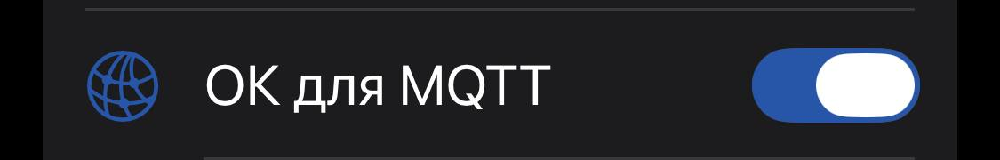

## Каналы

**Где найти:** Настройки → Каналы → Основной → MQTT.

| Поле | Значение |
| :--- | :--- |
| MQTT Включена восходящая связь | вкл |
| MQTT Нисходящая связь включена | выкл |

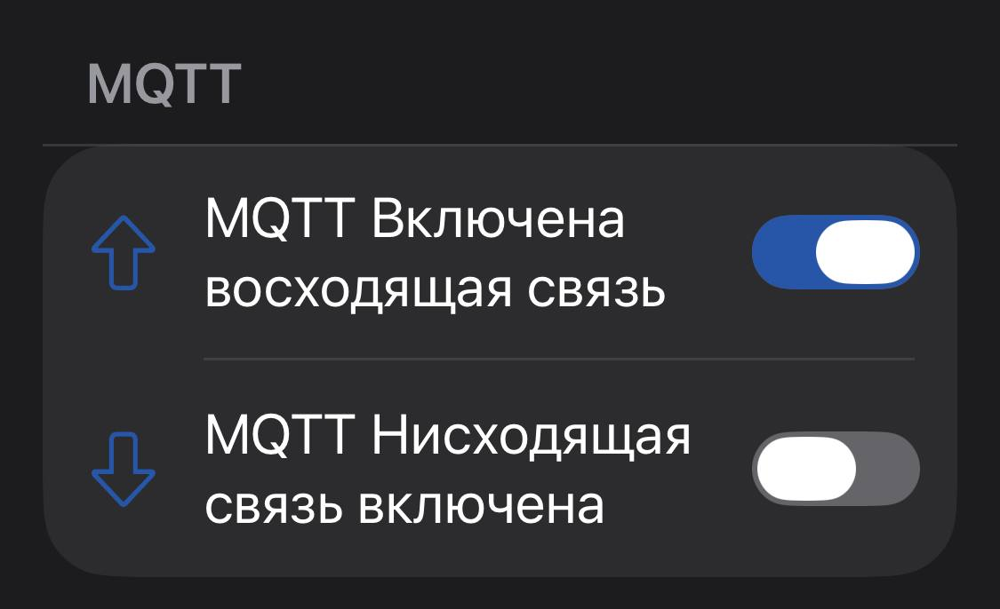

## MQTT

**Где найти:** Настройки → MQTT.

### Параметры

| Поле | Значение |
| :--- | :--- |
| MQTT Enabled | вкл |
| MQTT клиент-прокси | вкл |
| Подключение к MQTT через прокси | вкл |
| Шифрование включено | выкл |

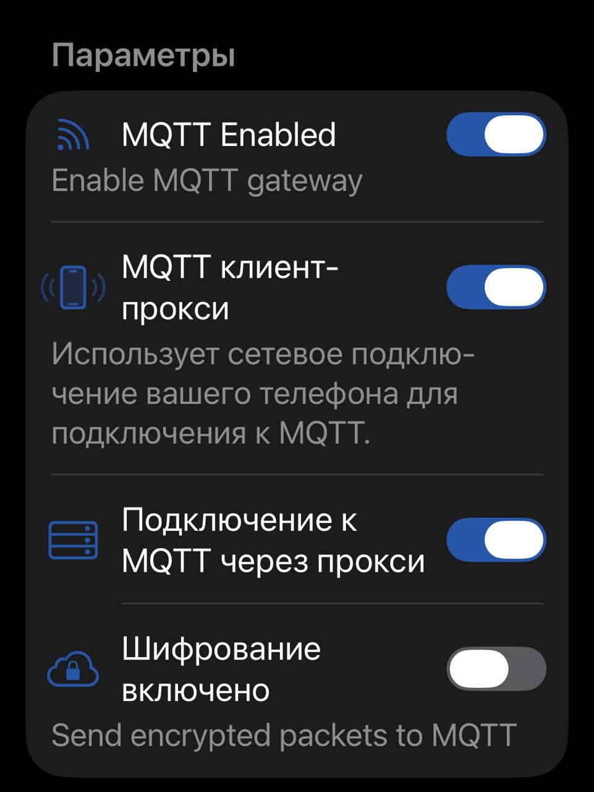

### Сервер

| Поле | Значение |
| :--- | :--- |
| Адрес | домен вашего сервера (без порта) |
| Имя пользователя | из настроек брокера в MeshMonitor |
| Пароль | из настроек брокера в MeshMonitor |
| TLS включен | **выкл** |

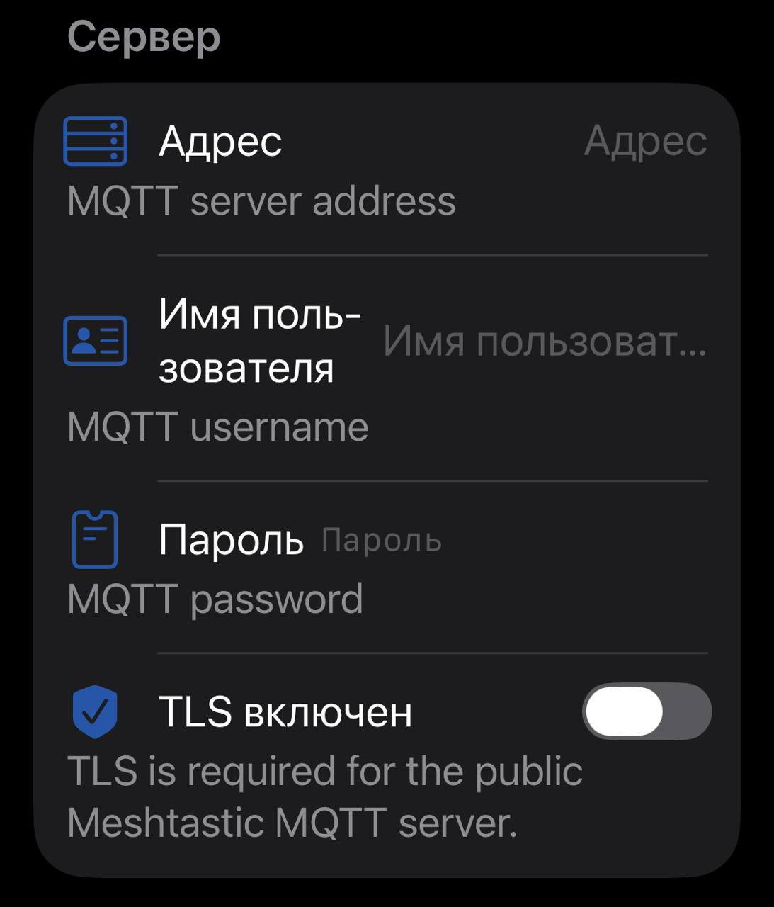

### Основная тема

| Поле | Значение |
| :--- | :--- |
| Основная тема | `msh` |

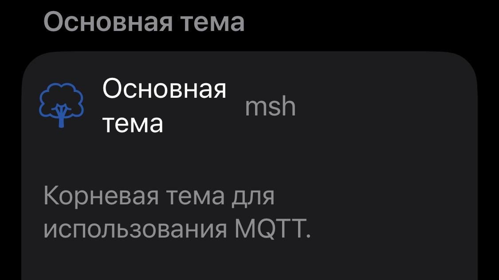

### Отчет карты

| Поле | Значение |
| :--- | :--- |
| Map Reporting | вкл |
| Согласие на незашифрованную передачу данных ноды через MQTT | вкл |

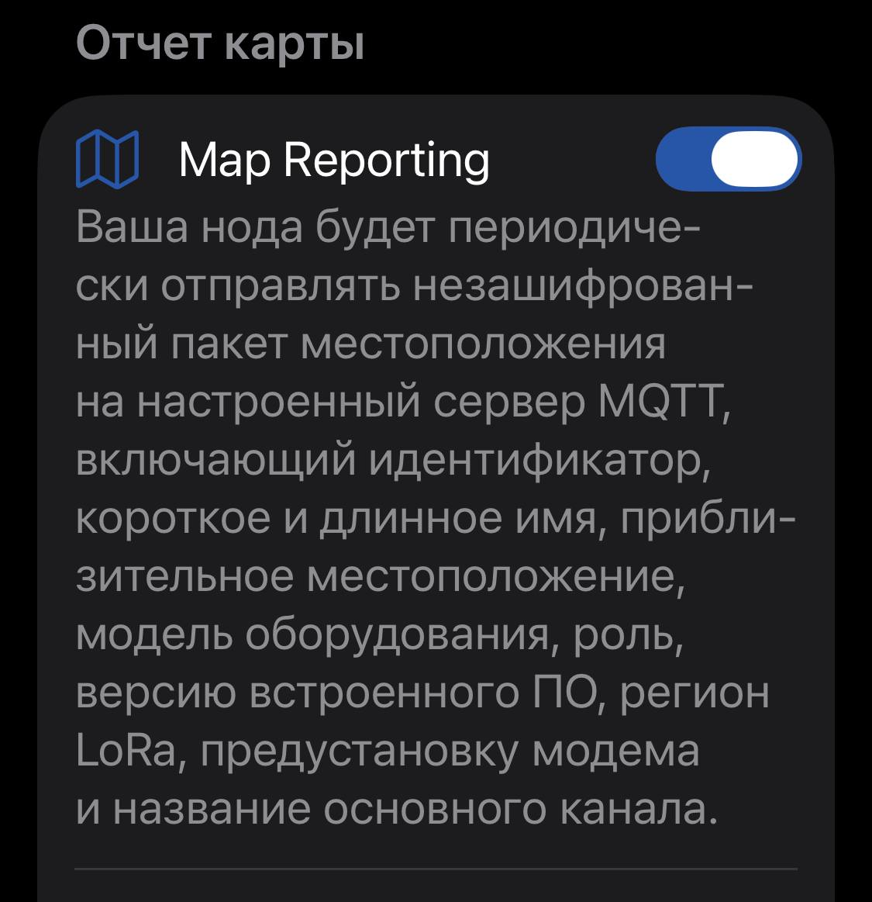

---

# Android

## LoRa

**Где найти:** Настройки → LoRa.

| Поле | Значение |
| :--- | :--- |
| OK в MQTT | вкл |

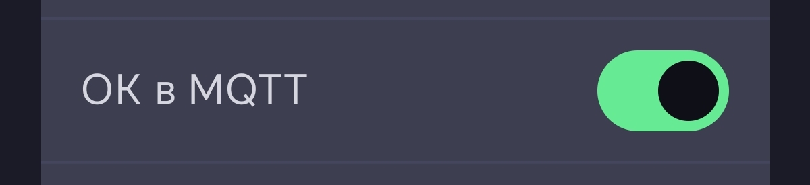

## Каналы

**Где найти:** Настройки → Каналы → Основной → MQTT.

| Поле | Значение |
| :--- | :--- |
| Uplink включен | вкл |
| Downlink включен | выкл |

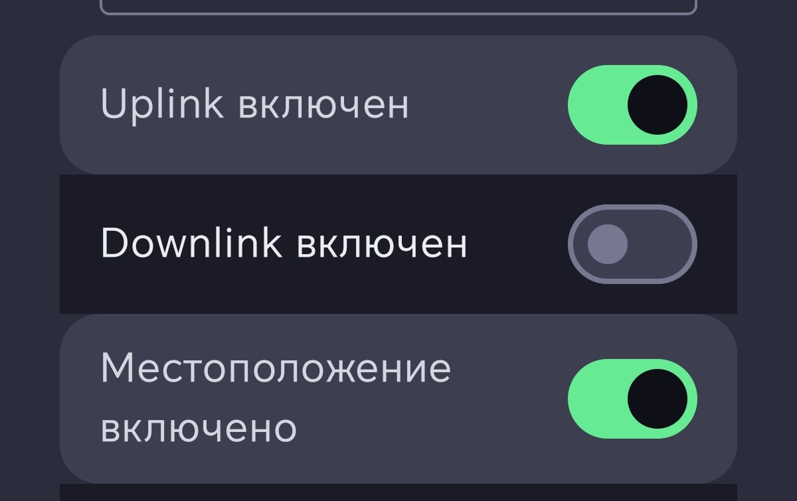

## MQTT

**Где найти:** Настройки модуля.

### Настройка MQTT

| Поле | Значение |
| :--- | :--- |
| MQTT включен | вкл |
| Адрес | домен вашего сервера (без порта) |
| Имя пользователя | из настроек брокера в MeshMonitor |
| Пароль | из настроек брокера в MeshMonitor |
| Шифрование включено | выкл |
| TLS включен | **выкл** |
| Корневая тема | `msh` |
| Прокси клиенту включен | вкл |

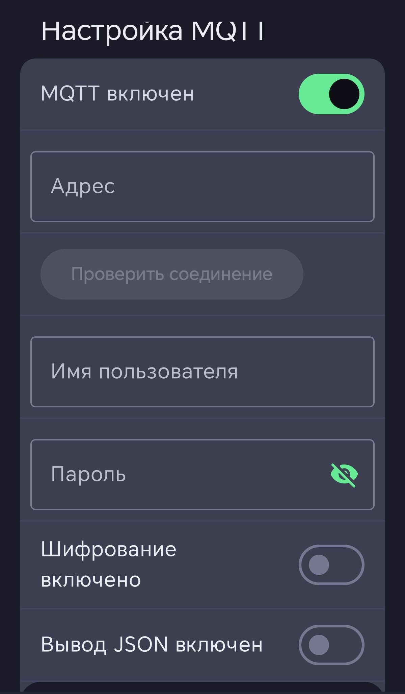
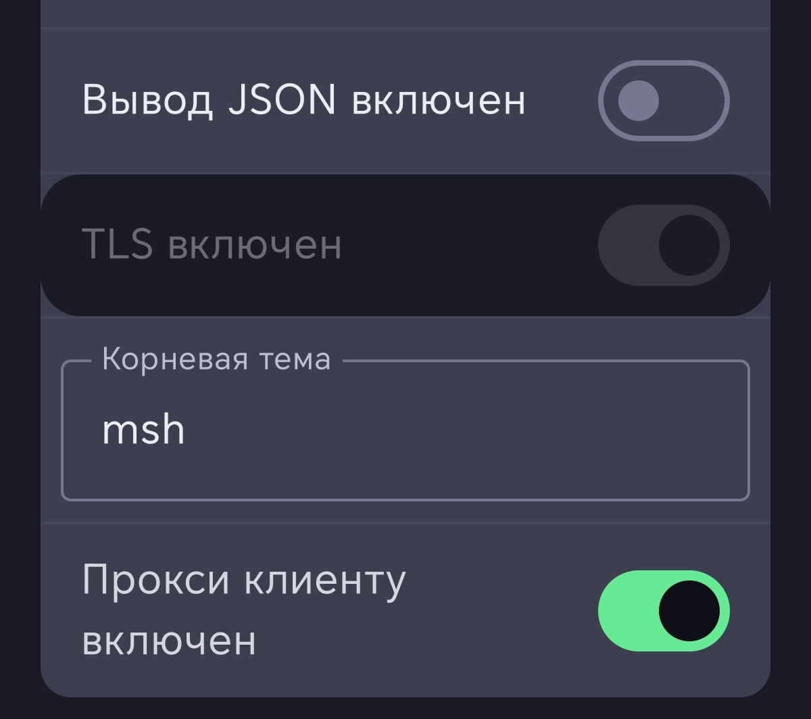

### Отчеты по карте

| Поле | Значение |
| :--- | :--- |
| Отчеты по карте | вкл |
| Я согласен | вкл |

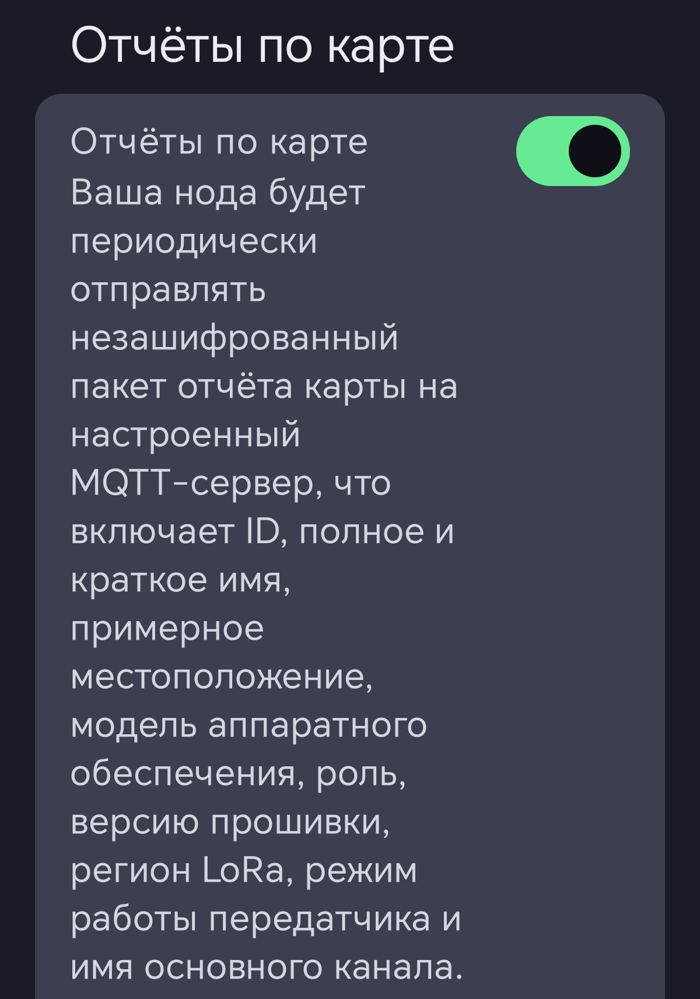
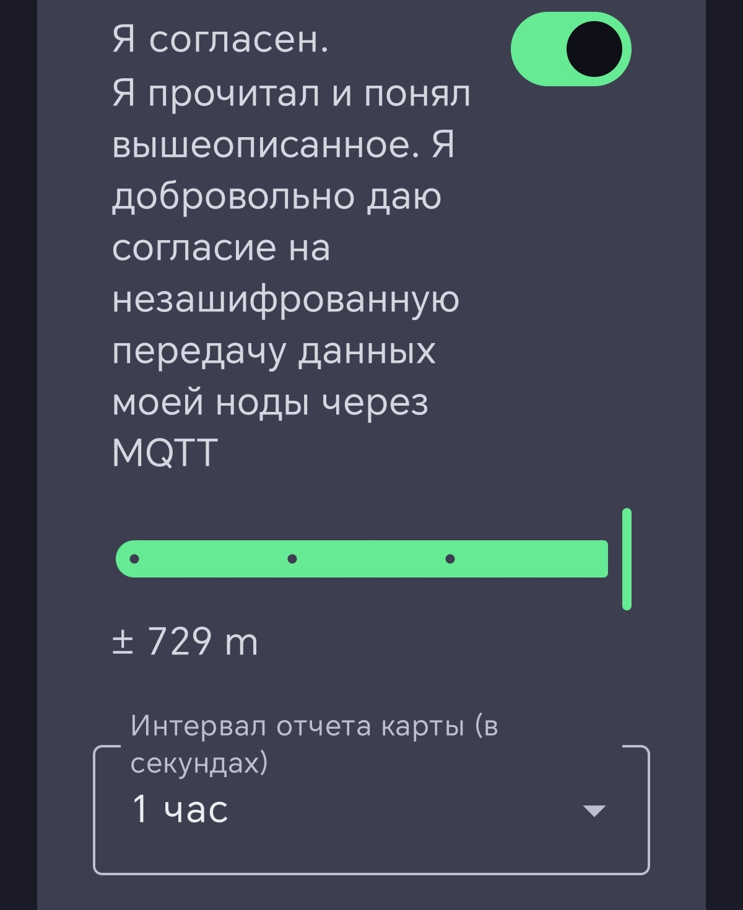

---

## Что нужно, чтобы ноды слышали друг друга и общались через MQTT

Чтобы ноды в вашей mesh-сети могли обмениваться сообщениями друг с другом и через MQTT, должны быть выполнены **все** условия ниже. Если хотя бы одно не выполнено, связь может не работать.

### 1. Основные настройки MQTT (на шлюзовой ноде)
- **Downlink включён.** На основном канале, помимо Uplink, должен быть включён Downlink.
  - iPhone: 
  - Android: 
- **OK для MQTT включён.** В настройках LoRa на **каждой** ноде, которая должна принимать сообщения из MQTT.
- **MQTT-прокси включён.** На iPhone — «MQTT клиент-прокси» и «Подключение к MQTT через прокси», на Android — «Прокси клиенту включен».
- **TLS выключен.**
- **Шифрование выключено.**

### 2. Настройки, критичные для «слышимости» нод
- **Регион LoRa (LoRa Region).** Все ноды должны использовать **один и тот же регион** (например, RU). Регион определяет частотный план и автоматически задаёт корневой топик MQTT (msh). Если регионы разные, ноды не услышат друг друга.
- **Root Topic.** Если используется нестандартный root topic, он должен быть **идентичным** на всех нодах-шлюзах. Иначе они будут публиковать сообщения в разные топики.
- **Имя канала (Channel Name).** Канал, через который идёт обмен (обычно Primary или LongFast), должен иметь **одинаковое имя** на всех нодах.
- **Ignore MQTT.** В настройках **LoRa** эта опция должна быть **выключена** (off). Если её включить, нода будет игнорировать все пакеты, пришедшие из MQTT.
- **Hop Limit (Лимит прыжков).** Рекомендуется значение **3** (или выше для больших сетей). Если лимит равен 0, пакет не будет передан дальше.

> **Важно:** Для корректной работы двусторонней связи на **всех** нодах, которые должны принимать сообщения из MQTT, необходимо включить **OK для MQTT** (iPhone) / **OK в MQTT** (Android) в настройках LoRa.

### 3. Нюансы и подводные камни
- **«Нулевой хоп»:** Если нода, отправляющая сообщение, не имеет прямого подключения к MQTT, и сообщение не было «услышано» другими нодами, оно может **не передаваться по LoRa**.
- **Квитанции (ACK):** При включённом только Uplink (без Downlink) нода **не будет подписываться на топики MQTT** и, следовательно, **не получит квитанцию** о доставке.
- **Шифрование:** Если вы хотите, чтобы сообщения, отправленные из MQTT в LoRa-сеть, были зашифрованы, убедитесь, что на канале установлен ключ шифрования (PSK), одинаковый на всех нодах.

---

## ⚠️ Совместимость Android и MeshMonitor

На Android приём и отправка сообщений через MeshMonitor **нестабильны** из-за известных багов в приложении Meshtastic. Основная причина: при использовании MQTT-прокси приложение на Android **принудительно** пытается подключиться по **TLS на порт 8883**, даже если в настройках TLS выключен. Брокер MeshMonitor работает на порту **1883 без TLS** — из-за этого соединение не устанавливается.

**Что это значит на практике:**
- На **iPhone** приём и отправка через MeshMonitor работают.
- На **Android** — могут работать через прокси-клиент, но с проблемами: таймауты при выключенном экране, баги с «Proxy to client», проблемы после обновления прошивки.
- Если нужна **стабильная двусторонняя связь**, используйте **iPhone** в качестве шлюза.

---

## Известные баги

- **Прошивка 2.7.15+ (nRF52):** `proxy_to_client_enabled` принудительно включается при активации MQTT. Обход — только CLI: `meshtastic --set mqtt.proxy_to_client_enabled false`.
- **Android и TLS:** приложение принудительно использует TLS на порту 8883, что конфликтует с брокером MeshMonitor на порту 1883.
- **Android, таймаут MQTT:** соединение разрывается через 90 секунд при выключенном экране.

---

## Документация

### Приложение Meshtastic

- [Meshtastic — официальный сайт](https://meshtastic.org/)
- [Meshtastic — документация](https://meshtastic.org/docs/)
- [MQTT Module Configuration](https://meshtastic.org/docs/configuration/module/mqtt/)
- [LoRa Configuration](https://meshtastic.org/docs/configuration/radio/lora/)
- [Channels Configuration](https://meshtastic.org/docs/configuration/radio/channels/)
- [Meshtastic MQTT для Apple](https://meshtastic.org/docs/software/apple/user/mqtt/)
- [Meshtastic MQTT для Android](https://github.com/meshtastic/Meshtastic-Android/blob/main/docs/es-rES/user/mqtt.md)

### Сервис MeshMonitor

- [Официальный сайт](https://meshmonitor.org/)
- [Getting Started](https://meshmonitor.org/getting-started)
- [Features](https://meshmonitor.org/features)
- [Embedded MQTT Broker & Bridge](https://meshmonitor.org/features/mqtt-broker)
- [Multi-Source](https://meshmonitor.org/features/multi-source)
- [FAQ](https://meshmonitor.org/faq.html)