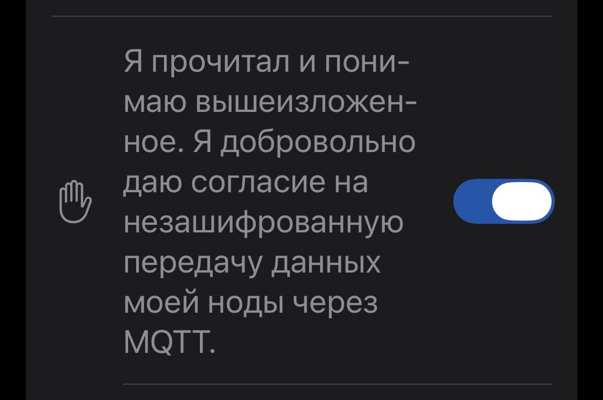

# Настройка ноды Meshtastic

## Введение

**Meshtastic** — это открытый проект, который превращает недорогие LoRa-радио в платформу для дальней автономной связи в местах, где нет интернета или сотовой сети. Устройства образуют **mesh-сеть** (ячеистую сеть), в которой каждый узел автоматически ретранслирует сообщения дальше, что позволяет передавать данные на десятки километров без вышек и роутеров.

### Как это работает

Сеть строится на технологии **LoRa** — это беспроводной протокол дальнего радиуса действия с низким энергопотреблением, который не требует лицензий или разрешений в большинстве регионов. Устройства (ноды) соединяются с телефоном или компьютером через Bluetooth, Wi-Fi или USB и обмениваются текстовыми сообщениями, GPS-координатами и телеметрией.

### Основные возможности

- **Дальняя связь** — рекорд дальности составляет 331 км.
- **Автономность** — сеть не зависит от сотовых операторов и интернета.
- **Децентрализация** — выделенный роутер не нужен, каждый узел участвует в передаче.
- **Шифрование** — сообщения передаются в зашифрованном виде.
- **GPS-позиционирование** — опциональное отслеживание местоположения участников.

### Где применяется

Meshtastic используют для связи в туристических походах, на массовых мероприятиях, в спасательных операциях и в зонах стихийных бедствий, где обычная инфраструктура недоступна. Проект полностью community-driven и с открытым исходным кодом.

---

## Настройки в приложении Meshtastic

Названия разделов и полей отличаются на iOS и Android. Настройки даны отдельно для каждой платформы.

1. Подключить ноду к телефону по Bluetooth через приложение Meshtastic.
2. Открыть настройки приложения.
3. Заполнить разделы **LoRa**, **Каналы** и **MQTT** для своей платформы.

---

# iPhone

## LoRa

**Где найти:** Настройки → LoRa.

| Поле | Значение |
| :--- | :--- |
| OK для MQTT | вкл |

## Каналы

**Где найти:** Настройки → Каналы → Основной → MQTT.

| Поле | Значение |
| :--- | :--- |
| MQTT Включена восходящая связь | вкл |
| MQTT Нисходящая связь включена | выкл |

## MQTT

**Где найти:** Настройки → MQTT.

### Параметры

| Поле | Значение |
| :--- | :--- |
| MQTT Enabled | вкл |
| MQTT клиент-прокси | вкл |
| Подключение к MQTT через прокси | вкл |
| Шифрование включено | выкл |

### Сервер

| Поле | Значение |
| :--- | :--- |
| Адрес | домен вашего сервера (без порта) |
| Имя пользователя | из настроек брокера в MeshMonitor |
| Пароль | из настроек брокера в MeshMonitor |
| TLS включен | **выкл** |

### Основная тема

| Поле | Значение |
| :--- | :--- |
| Основная тема | `msh` |

### Отчет карты

| Поле | Значение |
| :--- | :--- |
| Map Reporting | вкл |
| Согласие на незашифрованную передачу данных ноды через MQTT | вкл |

---

# Android

## LoRa

**Где найти:** Настройки → LoRa.

| Поле | Значение |
| :--- | :--- |
| OK в MQTT | вкл |

## Каналы

**Где найти:** Настройки → Каналы → Основной → MQTT.

| Поле | Значение |
| :--- | :--- |
| Uplink включен | вкл |
| Downlink включен | выкл |

## MQTT

**Где найти:** Настройки модуля.

### Настройка MQTT

| Поле | Значение |
| :--- | :--- |
| MQTT включен | вкл |
| Адрес | домен вашего сервера (без порта) |
| Имя пользователя | из настроек брокера в MeshMonitor |
| Пароль | из настроек брокера в MeshMonitor |
| Шифрование включено | выкл |
| TLS включен | **выкл** |
| Корневая тема | `msh` |
| Прокси клиенту включен | вкл |

### Отчеты по карте

| Поле | Значение |
| :--- | :--- |
| Отчеты по карте | вкл |
| Я согласен | вкл |

---

**Известный баг:** в прошивке 2.7.15 (и alpha 2.7.16) `proxy_to_client_enabled` принудительно включается при активации MQTT. Обход — только CLI: `meshtastic --set mqtt.proxy_to_client_enabled false`.

---

## Документация

### Приложение Meshtastic

- [Meshtastic — официальный сайт](https://meshtastic.org/)
- [Meshtastic — документация](https://meshtastic.org/docs/)
- [MQTT Module Configuration](https://meshtastic.org/docs/configuration/module/mqtt/)
- [LoRa Configuration](https://meshtastic.org/docs/configuration/radio/lora/)
- [Channels Configuration](https://meshtastic.org/docs/configuration/radio/channels/)
- [Meshtastic MQTT для Apple](https://meshtastic.org/docs/software/apple/user/mqtt/)
- [Meshtastic MQTT для Android](https://github.com/meshtastic/Meshtastic-Android/blob/main/docs/es-rES/user/mqtt.md)

### Сервис MeshMonitor

- [Официальный сайт](https://meshmonitor.org/)
- [Getting Started](https://meshmonitor.org/getting-started)
- [Features](https://meshmonitor.org/features)
- [Embedded MQTT Broker & Bridge](https://meshmonitor.org/features/mqtt-broker)
- [Multi-Source](https://meshmonitor.org/features/multi-source)
- [FAQ](https://meshmonitor.org/faq.html)